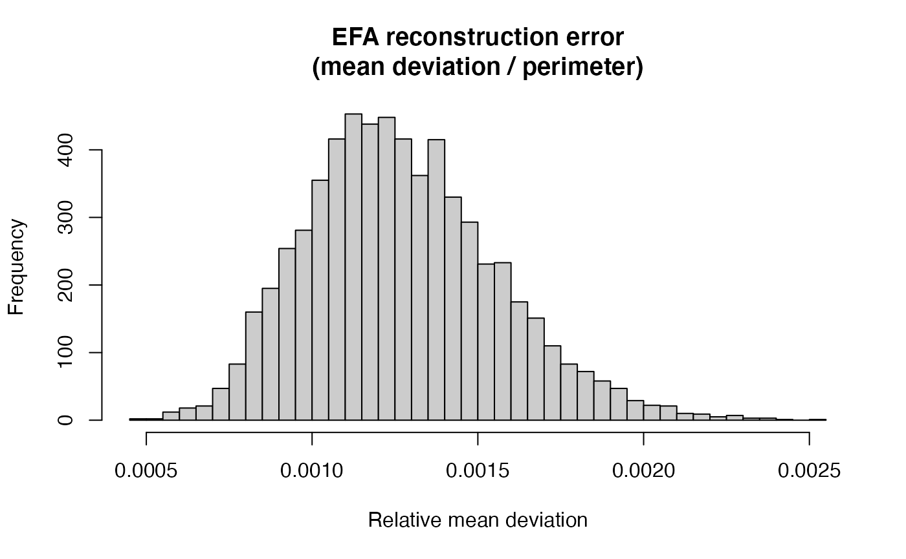
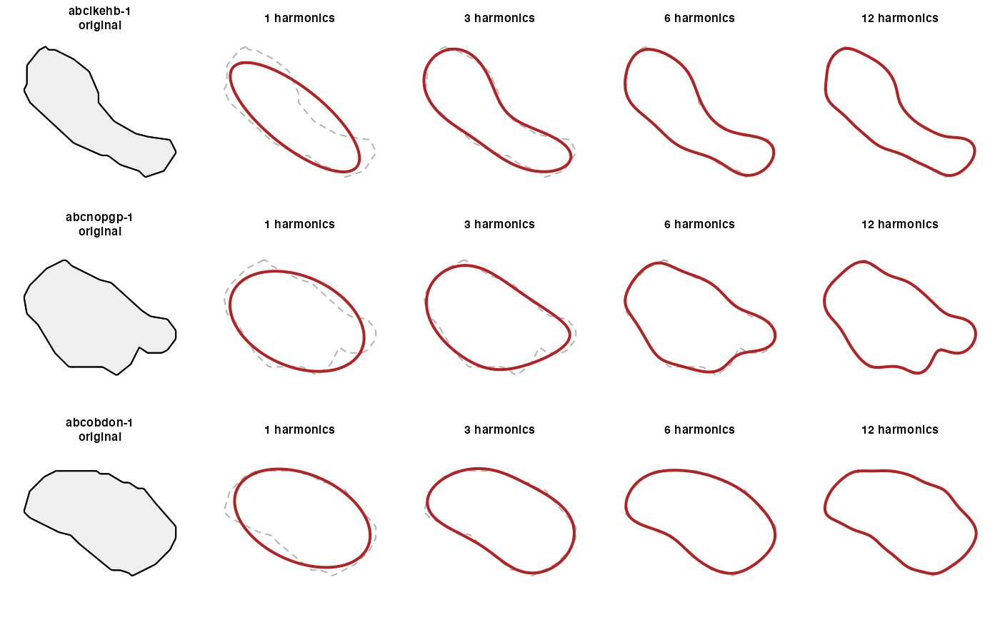
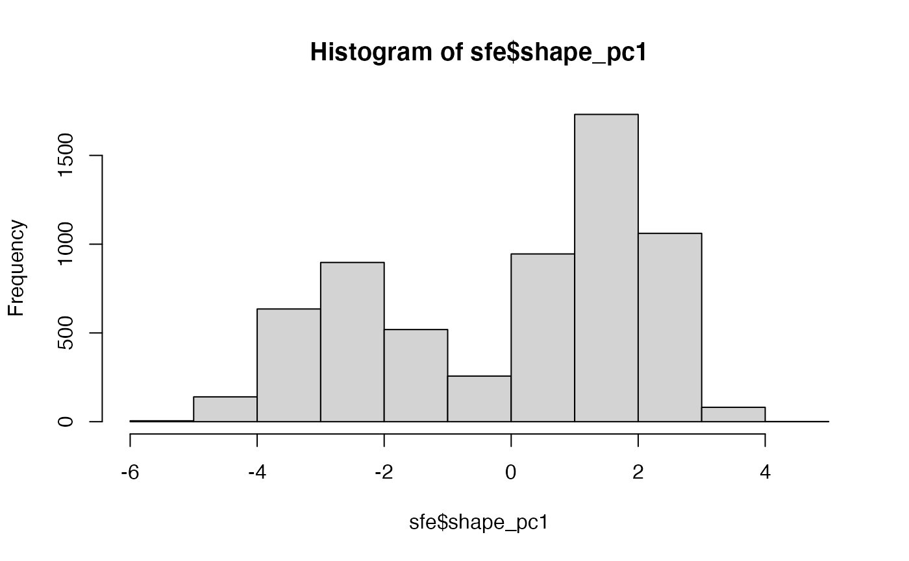

<div id="main" class="col-md-9" role="main">

# stellfou: exploration of elliptical fourier analysis for segmentations in spatial transcriptomics

<div class="section level2">

## Demonstration run

<div class="section level3">

### Data acquisition

Use SpatialFeatureExperiment to acquire a demonstration Xenium dataset.

<div id="cb1" class="sourceCode">

``` r
library(stellfou)
library(SpatialFeatureExperiment)
library(SFEData)
library(Voyager)
library(SummarizedExperiment) # for assay(), rowData()
```

</div>

<div id="cb2" class="sourceCode">

``` r
# --- Load a Xenium dataset with cell segmentations ---
sfepath = XeniumOutput("v2")
```

</div>

    ## see ?SFEData and browseVignettes('SFEData') for documentation

    ## loading from cache

    ## The downloaded files are in /Users/vincentcarey/SHAPES/stellfou/vignettes/xenium2

<div id="cb6" class="sourceCode">

``` r
sfe = readXenium(sfepath)
```

</div>

    ## >>> Preprocessed sf segmentations found
    ## >>> Reading cell and nucleus segmentations

    ## >>> Reading cell metadata -> `cells.parquet`

    ## >>> Reading h5 gene count matrix

    ## >>> filtering cellSeg geometries to match 6272 cells with counts > 0

    ## >>> filtering nucSeg geometries to match 6158 cells with counts > 0

</div>

<div class="section level3">

### Pipeline execution

Use a compact approach to modeling all cell boundary traces. The
workflow updates the input data structure. The analysis is based on the
Momocs package, see the 2014 Journal of Statistical Software
[paper](https://www.jstatsoft.org/article/view/v056i13).

<div id="cb12" class="sourceCode">

``` r
# --- Run the full pipeline ---
sfe # before
```

</div>

    ## class: SpatialFeatureExperiment 
    ## dim: 514 6272 
    ## metadata(1): Samples
    ## assays(1): counts
    ## rownames(514): ENSG00000121270 ENSG00000130234 ...
    ##   UnassignedCodeword_0497 UnassignedCodeword_0499
    ## rowData names(3): ID Symbol Type
    ## colnames(6272): abclkehb-1 abcnopgp-1 ... odmgoega-1 odmgojlc-1
    ## colData names(9): transcript_counts control_probe_counts ...
    ##   nucleus_area sample_id
    ## reducedDimNames(0):
    ## mainExpName: NULL
    ## altExpNames(0):
    ## spatialCoords names(2) : x_centroid y_centroid
    ## imgData names(4): sample_id image_id data scaleFactor
    ## 
    ## unit: micron
    ## Geometries:
    ## colGeometries: centroids (POINT), cellSeg (POLYGON), nucSeg (MULTIPOLYGON) 
    ## 
    ## Graphs:
    ## sample01:

<div id="cb14" class="sourceCode">

``` r
system.time(sfe <- run_efa_pipeline(sfe, n_harmonics = 12))
```

</div>

    ## Extracting cell boundaries...

    ## Computing EFA (12 harmonics)...

    ##   Successfully computed EFA for 6272 / 6272 cells.

    ##   EFA result fields: A, B, C, D, size, theta, psi, ao, co, lnef

    ## Storing in SFE...

    ##   0 cells have NA shape descriptors (degenerate boundaries).

    ## Computing per-cell goodness-of-fit...

    ##   Median rel. mean deviation: 0.00124

    ##   Median area ratio: 0.9998

    ## Running PCA on shape space...

    ## Done. New reducedDims: 'EFA', 'EFA_PCA'.

    ## New colData columns: 'efa_complexity', 'efa_ellipticity', 'efa_gof_*'.

    ##    user  system elapsed 
    ##  14.307   1.010  15.337

<div id="cb28" class="sourceCode">

``` r
sfe # after
```

</div>

    ## class: SpatialFeatureExperiment 
    ## dim: 514 6272 
    ## metadata(1): Samples
    ## assays(1): counts
    ## rownames(514): ENSG00000121270 ENSG00000130234 ...
    ##   UnassignedCodeword_0497 UnassignedCodeword_0499
    ## rowData names(3): ID Symbol Type
    ## colnames(6272): abclkehb-1 abcnopgp-1 ... odmgoega-1 odmgojlc-1
    ## colData names(17): transcript_counts control_probe_counts ...
    ##   efa_gof_area_ratio efa_gof_power_captured
    ## reducedDimNames(2): EFA EFA_PCA
    ## mainExpName: NULL
    ## altExpNames(0):
    ## spatialCoords names(2) : x_centroid y_centroid
    ## imgData names(4): sample_id image_id data scaleFactor
    ## 
    ## unit: micron
    ## Geometries:
    ## colGeometries: centroids (POINT), cellSeg (POLYGON), nucSeg (MULTIPOLYGON) 
    ## 
    ## Graphs:
    ## sample01:

<div class="section level4">

#### Discussion

Claude gives the following discussion of workflow phases

-   Geometry extraction: cellSeg polygons from SFE are sf POLYGON (or
    sometimes MULTIPOLYGON for oddly segmented cells). The extractor
    handles both cases, taking the largest polygon for MULTIPOLYGONs.
    The closing vertex (required by sf but not by EFA) is stripped.

-   Arc-length resampling: EFA assumes uniformly-sampled contours for
    well-behaved coefficients. Cell segmentation polygons are often
    vertex-sparse (Cellpose/Baysor may emit 20–50 vertices per cell), so
    resampling to 200 equally-spaced points by arc length before Fourier
    decomposition avoids aliasing artifacts.

-   Coefficient storage: The 4×N coefficients (*a*_(*n*), *b*_(*n*),
    *c*_(*n*), *d*_(*n*)) go into `reducedDim(sfe, "EFA")`, which fits
    naturally into the SingleCellExperiment paradigm — you can run PCA
    on this shape space the same way you’d run it on gene expression.
    Two derived scalars go into `colData`: `efa_ellipticity` (power
    fraction in the first harmonic — 1.0 for a perfect ellipse, lower
    for complex shapes) and `efa_complexity` (harmonics needed for 99%
    power).

-   Voyager integration: Since the EFA PCA scores live in reducedDim,
    you can immediately compute spatial autocorrelation of cell shape
    using Voyager’s colDataMoransI(), testing whether morphologically
    similar cells cluster spatially. The example at the bottom sketches
    this, along with correlating shape ellipticity against gene
    expression.

One thing to be aware of: Momocs efourier\_norm() initializes a, b, and
c parameters to (1,0,0) (fixing scale, rotation, and starting point), so
if you want to preserve absolute cell size in the shape space, skip
normalization and handle alignment separately. For most downstream
analyses (clustering cells by shape irrespective of size), normalized
coefficients are what you want.

</div>

</div>

<div class="section level3">

### Goodness-of-fit

Examine some quality criteria.

<div id="cb30" class="sourceCode">

``` r
head(colData(sfe)[, c("efa_complexity", "efa_ellipticity")])
```

</div>

    ## DataFrame with 6 rows and 2 columns
    ##            efa_complexity efa_ellipticity
    ##                 <integer>       <numeric>
    ## abclkehb-1              3        0.968491
    ## abcnopgp-1              2        0.983748
    ## abcobdon-1              2        0.989320
    ## abcohgbl-1              3        0.978474
    ## abcoochm-1              1        0.991878
    ## abcoplda-1              3        0.971002

<div id="cb32" class="sourceCode">

``` r
# GoF summary across all cells
gof_cols <- grep("^efa_gof_", names(colData(sfe)), value = TRUE)
summary(as.data.frame(colData(sfe)[, gof_cols]))
```

</div>

    ##  efa_gof_mean_dev   efa_gof_max_dev   efa_gof_symmetric_hausdorff
    ##  Min.   :0.008427   Min.   :0.03299   Min.   :0.03299            
    ##  1st Qu.:0.027264   1st Qu.:0.10612   1st Qu.:0.10612            
    ##  Median :0.033008   Median :0.13614   Median :0.13614            
    ##  Mean   :0.036783   Mean   :0.15040   Mean   :0.15041            
    ##  3rd Qu.:0.042031   3rd Qu.:0.17785   3rd Qu.:0.17785            
    ##  Max.   :0.236153   Max.   :0.74138   Max.   :0.74138            
    ##  efa_gof_rel_mean_dev efa_gof_area_ratio efa_gof_power_captured
    ##  Min.   :0.000470     Min.   :0.9974     Min.   :1             
    ##  1st Qu.:0.001069     1st Qu.:0.9996     1st Qu.:1             
    ##  Median :0.001244     Median :0.9998     Median :1             
    ##  Mean   :0.001270     Mean   :0.9997     Mean   :1             
    ##  3rd Qu.:0.001449     3rd Qu.:0.9999     3rd Qu.:1             
    ##  Max.   :0.002526     Max.   :1.0018     Max.   :1

<div id="cb34" class="sourceCode">

``` r
# Distribution of relative mean deviation
hist(sfe$efa_gof_rel_mean_dev, breaks = 50,
     main = "EFA reconstruction error\n(mean deviation / perimeter)",
     xlab = "Relative mean deviation", col = "grey80")
```

</div>



<div class="section level4">

#### Identify cells with poor fits (may need more harmonics)

<div id="cb35" class="sourceCode">

``` r
poor_fit <- which(sfe$efa_gof_rel_mean_dev > 0.01)
message(length(poor_fit), " cells have > 1% relative mean deviation")
```

</div>

    ## 0 cells have > 1% relative mean deviation

</div>

</div>

<div class="section level3">

### Visualize a subset of fits

<div id="cb37" class="sourceCode">

``` r
# --- Visualize progressive reconstruction for a few cells ---
boundaries <- extract_cell_boundaries(sfe)
efa_result <- compute_efa(boundaries, n_harmonics = 12)
```

</div>

    ##   Successfully computed EFA for 6272 / 6272 cells.

    ##   EFA result fields: A, B, C, D, size, theta, psi, ao, co, lnef

<div id="cb40" class="sourceCode">

``` r
plot_efa_reconstruction(boundaries, efa_result,
                        cell_ids = names(boundaries)[1:3],
                        n_harmonics_seq = c(1, 3, 6, 12))
```

</div>



</div>

<div class="section level3">

### Some statistics

<div id="cb41" class="sourceCode">

``` r
# --- PCA on shape space is already in reducedDim ---
# Can be used with Voyager for spatial autocorrelation of shape:
colGraph(sfe, "knn") <- findSpatialNeighbors(sfe, method = "knearneigh", k = 6)
sfe$shape_pc1 <- reducedDim(sfe, "EFA_PCA")[, 1]
hist(sfe$shape_pc1)
```

</div>



</div>

</div>

</div>
